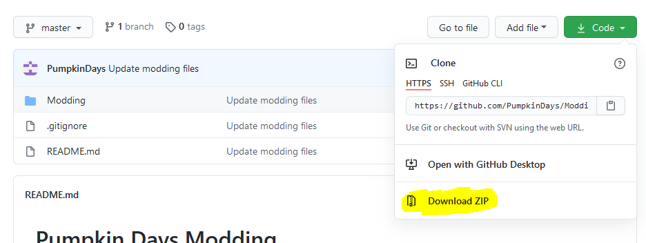
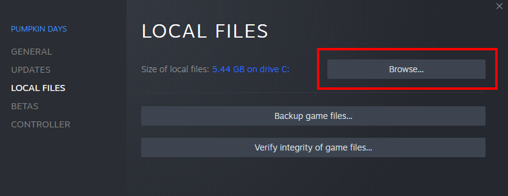
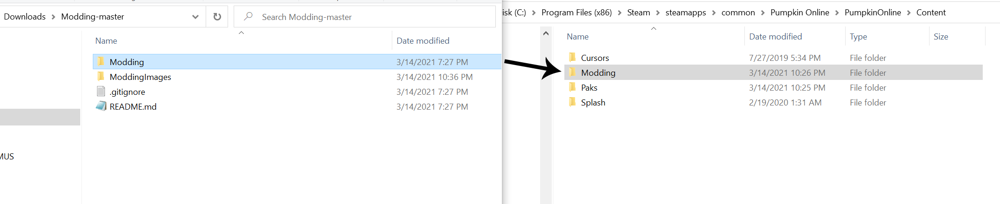
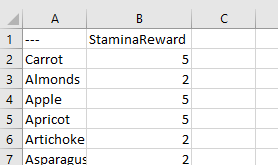

# Pumpkin Days Modding

## Initial Setup 

1. To get started with modding, download the modding files from this repository.

<br>

2. Browse to your Steam installation of Pumpkin Days. You can locate the Pumpkin Days folder by going to your steam library and right clicking Pumpkin Days -> Properties -> Local Files -> Browse.

<br>

3. Copy the ```Modding``` folder from this repository into the ```<PumpkinDaysInstallationFolder>/PumpkinOnline/Content``` folder.


Now that you have the modding files in place, you can start modifying the game's data tables. 

## The Modding Directory

The ```Modding``` folder that you copied into your Steam directory has several items:
- The ```Modding_Settings.txt``` file, which contains misc settings that control the mods. 
- The ```Mod_Profiles``` folder, which holds the different mod profiles that can be used. A mod profile is just a set of modifications to the game. 
    - The ```Default``` mod profile includes ```<DataTableName>_VALUES.txt``` and  ```<DataTableName>_SCHEMA.txt``` files. The VALUES files contains existing data table values so that you can more easily know what to modify, and the SCHEMA files show the structure of each data table. These files are for your use only, and have no impact on the mods themselves. 
## Making Your First Modification

Pumpkin Days mods work by modifying the game's data tables. A data table stores data related to the game in rows and columns. As an example, ```Consumable_Stamina_Data``` is the data table that specifies how much stamina is restored when eating food:



Modifications to data tables are made with JSON files that specify which properties to change in each row. Let's change the ```StaminaReward``` property in the ```Apple``` row so that apples give more stamina when eaten. 

First, create a JSON file with the data table's name in the appropriate location. To determine where the JSON file needs to be placed, locate the schema and value files for that data table. For ```Consumable_Stamina_Data```, the JSON file will need to be placed in ```Modding/Mod_Profiles/<ProfileName>/Blueprints/Data_Tables```. Now that you've created a file named ```Consumable_Stamina_Data.json``` and placed it in the correct folder, we can edit the values. 

Every JSON file is required to have a ```Rows``` array, which is an array of row objects. Each row object needs a ```RowName``` string that specifies which row is being modified, and any other values in that row that you wish to change.  This JSON can be used as a base template:
```json
{
  "Rows": [
  ]
}
```

To modify the stamina reward for apples, add an object for the ```Apple``` row, and specify a new value for ```StaminaReward```:
```json
{
  "Rows": [
    {
      "RowName": "Apple",
      "StaminaReward":  20
    }
  ]
}
```

At this point, you should be able to run the game and test the change by eating an Apple. To verify that everything worked correctly, you can check the logs folder as outlined in the [Troubleshooting](#Troubleshooting) section. A more easily noticeable change to make would be to rename an inventory item by changing the ```Name``` property.


## Troubleshooting
Each mod profile will generate logs located at ```Modding/Mod_Profiles/<ProfileName>/Logs```. One log for each data table is generated, and outlines what happened when trying to handle modding for that particular data table. An absence of errors generally means that the values in the JSON file were loaded normally.

## Types of JSON Fields


---
### Value

A ```Value``` is an individual value.
##### Types of values and examples:
- Integer: ```72```
- Float: ```2.5```
- String: ```"Bob's Kitten"```
- True/False: ```true```

The last type of value is an Enum value, which is one value out of a specific list. As an example, the ```ToolTier``` enum can be one of the following:
```
Wooden
Copper
Iron
etc.
```

Enum values should be specified as strings, with the value being one of the values defined in the schema. 

---
### Structure


A ```Structure``` is a group of values. Structures have specific values that belong to them, which are outlined in the schema.
An example is the ```MeatValues``` structure used in ```Animal_Properties_Data```:

 ```javascript
MeatValues: 
	GivesMeat: true/false
	MeatType: string
	BaseMeatAmount: integer
	MeatIncreaseInterval: integer
	MeatIncreaseAmount: integer
	MaxMeat: integer
```

The actual value of ```MeatValues``` for ```Hen_Red```:

```json
"MeatValues":
{
    "GivesMeat": true,
    "MeatType": "Chicken_Meat",
    "BaseMeatAmount": 25,
    "MeatIncreaseInterval": 336,
    "MeatIncreaseAmount": 10,
    "MaxMeat": 50
}
```


<u>If a value is not included in a structure, the default or existing value will be used.</u>

---
### Array

An ```Array``` is a list of items.

For now, arrays can only be set as a whole. Being able to edit/add/remove individual elements is still in the works.

Like everything else, each array is meant for <b>a specific type</b> of item. For example, ```Town_Data```'s ```Npcs``` array can only contain strings, as denoted by the schema:

```javascript
Npcs(Array): string
```


##### Examples:

An empty array:
 ```json
 []
 ```

An array of string values:
```json
[
    "You should stop by the bar sometime.",
    "I haven't seen you around lately."
]
```

An array of integer values:
```json
[
    1,
    2,
    3,
    5
]
```

An array of structures:
```json
[
    {
        "Name": "Zoe",
        "Occupation": "Bartender"
    },
    {
        "Name": "Julian",
        "Occupation": "Mayor"
    }
]
```


Arrays of arrays are <b>not</b> needed or supported.

---

## FAQ
- When are the JSON files loaded/How do I get new a change to show up in the game?
    - Currently, the files are loaded when the game is started. To get a new change to show up, restart the game.


